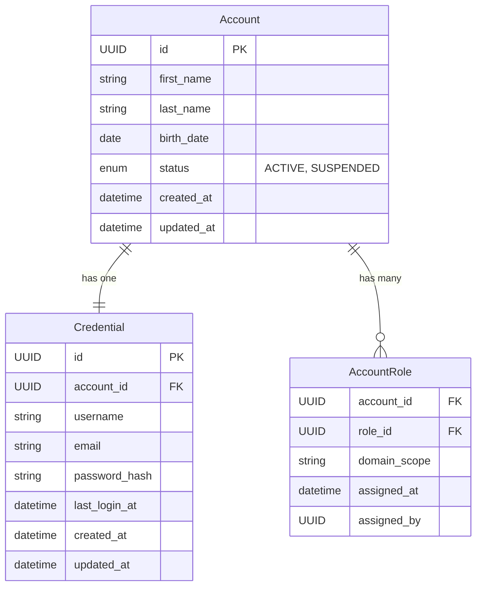
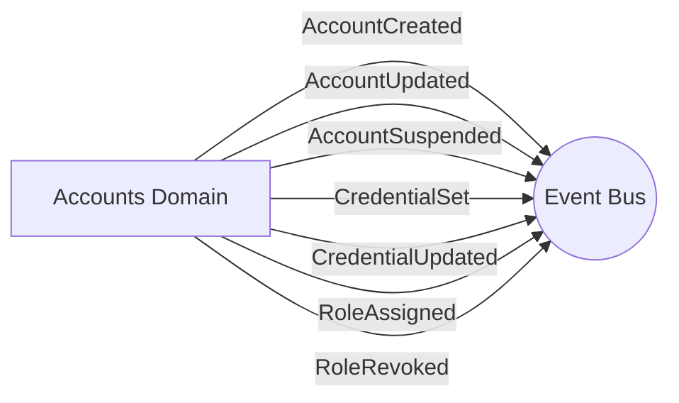

# Accounts Domain

## Overview
The Accounts domain is responsible for managing user identities, their login credentials, and the assignment of roles to these accounts. It cleanly separates the concept of an `Account` (identity and profile data) from `Credential` (authentication details) and `AccountRole` (authorization associations).

## Data Models

### Entities
| Entity | Description | Core Attributes |
|---|---|---|
| **Account** | The core identity entity (no login or role info). | `id`, `first_name`, `last_name`, `birth_date`, `status` |
| **Credential** | Login details separate from identity. | `id`, `account_id`, `username`, `email`, `password_hash`, `last_login_at` |
| **AccountRole** | Association between an Account and a Role, optionally scoped to a specific domain. | `account_id`, `role_id`, `domain_scope`, `assigned_at`, `assigned_by` |

## Events

The Accounts domain emits the following events when mutations occur:

### Emitted Events
- `AccountCreated(account_id)`
- `AccountUpdated(account_id)`
- `AccountSuspended(account_id)`
- `CredentialSet(account_id, credential_id)`
- `CredentialUpdated(account_id)`
- `RoleAssigned(account_id, role_id, domain_scope)`
- `RoleRevoked(account_id, role_id)`

### Subscribed Events
*The Accounts domain does not currently subscribe to events from other domains.*

## Services & Business Logic

The domain logic is split across three entity-specific services:

### Account Service
- Manages the lifecycle of an `Account`.
- Accounts are created as `ACTIVE` by default. 
- Suspensions are handled via a soft-delete mechanism setting the status to `SUSPENDED` rather than deleting the row.

### Credential Service
- Handles securely hashing passwords using `bcrypt`.
- Enforces uniqueness constraints on both `username` and `email`.
- Validates that an `Account` is active before allowing credentials to be set (raises `AccountSuspendedError` otherwise).

### AccountRole Service
- Manages attaching/detaching Roles to Accounts.
- Ensures duplicate role assignments for the same account are blocked (`RoleAlreadyAssigned`).

## API Endpoints

### Accounts

#### `POST /api/v1/accounts`
- **Use Case:** Registering a new account identity.
- **Request Schema (`CreateAccountRequest`):**
  - `first_name` (string, length 1-100, required)
  - `last_name` (string, length 1-100, required)
  - `birth_date` (date, optional)
- **Responses:**
  - **`201 Created`**: Returns `AccountResponse`.
  - **`400 Bad Request`**: Validation error if fields are missing or invalid.

#### `GET /api/v1/accounts`
- **Use Case:** Listing all accounts with pagination and filtering.
- **Query Parameters:**
  - `page` (integer, default: 1)
  - `limit` (integer, default: 20)
  - `search` (string, optional)
  - `status` (string, `active` or `suspended`, optional)
- **Responses:**
  - **`200 OK`**: Returns a paginated list of `AccountResponse`.
  - **`401/403`**: Unauthorized/Forbidden.

#### `GET /api/v1/accounts/<uuid>`
- **Use Case:** Fetching details of a specific account by its ID.
- **Responses:**
  - **`200 OK`**: Returns `AccountResponse`.
  - **`404 Not Found`**: Account not found.
  - **`401/403`**: Unauthorized/Forbidden.

#### `PUT /api/v1/accounts/<uuid>`
- **Use Case:** Updating existing account details (e.g., correcting a name).
- **Request Schema (`UpdateAccountRequest`):**
  - `first_name` (string, length 1-100, optional)
  - `last_name` (string, length 1-100, optional)
  - `birth_date` (date, optional)
- **Responses:**
  - **`200 OK`**: Returns updated `AccountResponse`.
  - **`400/422`**: Validation errors.
  - **`404 Not Found`**: Account not found.

#### `DELETE /api/v1/accounts/<uuid>`
- **Use Case:** Soft-deleting (suspending) an account.
- **Responses:**
  - **`200 OK`**: Returns updated `AccountResponse` with `status="SUSPENDED"`.
  - **`404 Not Found`**: Account not found.

### Credentials

#### `POST /api/v1/accounts/<uuid>/credentials`
- **Use Case:** Setting the initial login credentials for an account.
- **Request Schema (`SetCredentialsRequest`):**
  - `username` (string, length 3-100, required)
  - `email` (string, valid email, required)
  - `password` (string, length 8-128, required)
- **Responses:**
  - **`201 Created`**: Returns `CredentialResponse` (never includes password hash).
  - **`400 Bad Request`**: If credentials already exist or validation fails.
  - **`409 Conflict`**: If username or email is already taken.

#### `GET /api/v1/accounts/<uuid>/credentials`
- **Use Case:** Retrieving the credential metadata (like last login time) for an account.
- **Responses:**
  - **`200 OK`**: Returns `CredentialResponse`.
  - **`404 Not Found`**: Credentials not set.

#### `PUT /api/v1/accounts/<uuid>/credentials`
- **Use Case:** Updating email or changing the password.
- **Request Schema (`UpdateCredentialsRequest`):**
  - `username` (string, length 3-100, optional)
  - `email` (string, valid email, optional)
  - `password` (string, length 8-128, optional)
- **Responses:**
  - **`200 OK`**: Returns updated `CredentialResponse`.
  - **`409 Conflict`**: If new email or username is already taken.

### Account Roles

#### `POST /api/v1/accounts/<uuid>/roles`
- **Use Case:** Assigning a specific role to an account to grant permissions.
- **Request Schema (`AssignRoleRequest`):**
  - `role_id` (UUID, required)
  - `domain_scope` (string, optional)
- **Responses:**
  - **`201 Created`**: Returns `AccountRoleResponse`.
  - **`404 Not Found`**: If account or role does not exist.
  - **`409 Conflict`**: If the role is already assigned.

#### `GET /api/v1/accounts/<uuid>/roles`
- **Use Case:** Listing all roles assigned to this account.
- **Responses:**
  - **`200 OK`**: Returns a list of `AccountRoleResponse`.

#### `DELETE /api/v1/accounts/<uuid>/roles/<role_uuid>`
- **Use Case:** Revoking a previously assigned role.
- **Responses:**
  - **`200 OK`**: Returns a success confirmation envelope.

### Common Response Schemas

#### `AccountResponse`
- `id` (UUID)
- `first_name` (string)
- `last_name` (string)
- `birth_date` (date | null)
- `status` (string, e.g. ACTIVE, SUSPENDED)
- `created_at` (datetime)
- `updated_at` (datetime)

#### `CredentialResponse`
- `id` (UUID)
- `account_id` (UUID)
- `username` (string)
- `email` (string)
- `last_login_at` (datetime | null)
- `created_at` (datetime)
- `updated_at` (datetime)
- *(Note: `password_hash` is intentionally excluded)*

#### `AccountRoleResponse`
- `account_id` (UUID)
- `role_id` (UUID)
- `domain_scope` (string | null)
- `assigned_at` (datetime)
- `assigned_by` (UUID | null)
