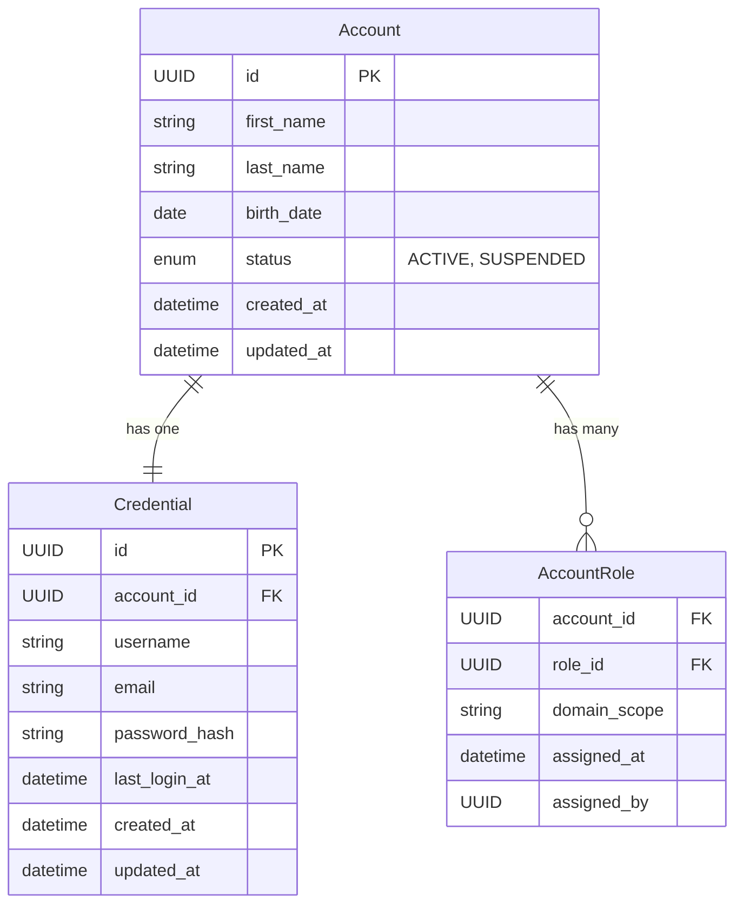
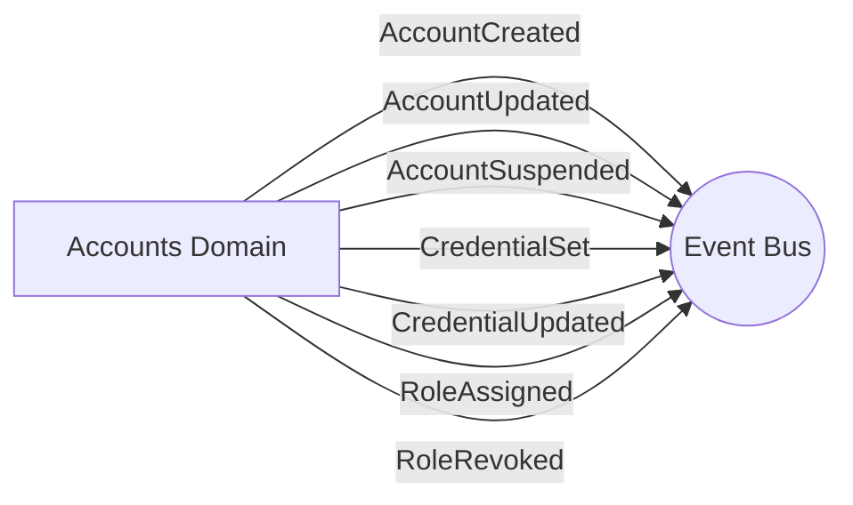

# Accounts Domain

## Overview
The Accounts domain is responsible for managing user identities, their login credentials, and the assignment of roles to these accounts. It cleanly separates the concept of an `Account` (identity and profile data) from `Credential` (authentication details) and `AccountRole` (authorization associations).

## Data Models

### Entities
| Entity | Description | Core Attributes |
|---|---|---|
| **Account** | The core identity entity (no login or role info). | `id`, `first_name`, `last_name`, `birth_date`, `status` |
| **Credential** | Login details separate from identity. | `id`, `account_id`, `username`, `email`, `password_hash`, `last_login_at` |
| **AccountRole** | Association between an Account and a Role, optionally scoped to a specific domain. | `account_id`, `role_id`, `domain_scope`, `assigned_at`, `assigned_by` |

## Events

The Accounts domain emits the following events when mutations occur:

### Emitted Events
- `AccountCreated(account_id)`
- `AccountUpdated(account_id)`
- `AccountSuspended(account_id)`
- `CredentialSet(account_id, credential_id)`
- `CredentialUpdated(account_id)`
- `RoleAssigned(account_id, role_id, domain_scope)`
- `RoleRevoked(account_id, role_id)`

### Subscribed Events
*The Accounts domain does not currently subscribe to events from other domains.*

## Services & Business Logic

The domain logic is split across three entity-specific services:

### Account Service
- Manages the lifecycle of an `Account`.
- Accounts are created as `ACTIVE` by default. 
- Suspensions are handled via a soft-delete mechanism setting the status to `SUSPENDED` rather than deleting the row.

### Credential Service
- Handles securely hashing passwords using `bcrypt`.
- Enforces uniqueness constraints on both `username` and `email`.
- Validates that an `Account` is active before allowing credentials to be set (raises `AccountSuspendedError` otherwise).

### AccountRole Service
- Manages attaching/detaching Roles to Accounts.
- Ensures duplicate role assignments for the same account are blocked (`RoleAlreadyAssigned`).

## API Endpoints

| Method | Endpoint | Description | Service Method |
|---|---|---|---|
| `POST` | `/api/v1/accounts` | Register a new account | `AccountService.create_account` |
| `GET` | `/api/v1/accounts` | List all accounts (paginated) | `AccountService.list_accounts` |
| `GET` | `/api/v1/accounts/<uuid>` | Get a specific account | `AccountService.get_account` |
| `PUT` | `/api/v1/accounts/<uuid>` | Update account details | `AccountService.update_account` |
| `DELETE`| `/api/v1/accounts/<uuid>` | Suspend an account | `AccountService.suspend_account` |
| `POST` | `/api/v1/accounts/<uuid>/credentials` | Set initial login credentials | `CredentialService.set_credentials` |
| `GET` | `/api/v1/accounts/<uuid>/credentials` | Get credential details | `CredentialService.get_credentials` |
| `PUT` | `/api/v1/accounts/<uuid>/credentials` | Update credentials (email/password) | `CredentialService.update_credentials` |
| `POST` | `/api/v1/accounts/<uuid>/roles` | Assign a role to an account | `AccountRoleService.assign_role` |
| `GET` | `/api/v1/accounts/<uuid>/roles` | List all roles for an account | `AccountRoleService.list_roles` |
| `DELETE`| `/api/v1/accounts/<uuid>/roles/<uuid>` | Revoke a role from an account | `AccountRoleService.revoke_role` |
