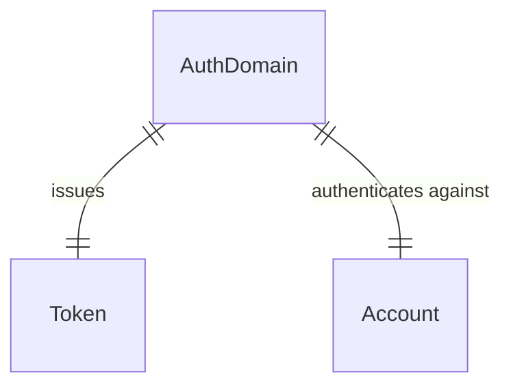
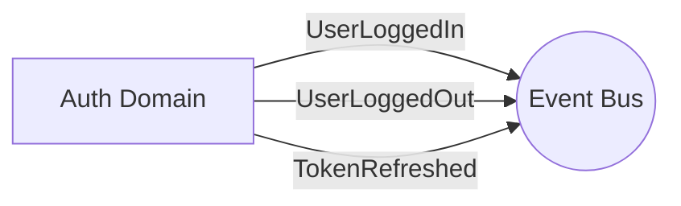

# Auth Domain

## Overview
The Auth domain manages the generation, validation, and revocation of JSON Web Tokens (JWT) for authenticated users. It relies on the Accounts domain to verify credentials and then issues access and refresh tokens for subsequent requests.

## Data Models

The Auth domain does not persist any core entities of its own to the database; it primarily acts as a secure token issuer and validator.

## Events

The Auth domain emits events related to authentication activities.

### Emitted Events
- `UserLoggedIn(account_id, ip_address)`
- `UserLoggedOut(account_id, jti)`
- `TokenRefreshed(account_id)`

## Services & Business Logic

### Auth Service
- **Login**: Validates credentials against the Accounts domain and issues a short-lived access token and a long-lived refresh token.
- **Logout**: Revokes the access token (typically by adding its JTI to a blocklist).
- **Refresh**: Accepts a valid refresh token and issues a new access token without requiring re-authentication.

## API Endpoints

| Method | Endpoint | Description | Service Method |
|---|---|---|---|
| `POST` | `/api/v1/auth/login` | Authenticate user and issue tokens | `AuthService.login` |
| `POST` | `/api/v1/auth/logout` | Invalidate current access token | `AuthService.logout` |
| `POST` | `/api/v1/auth/refresh` | Issue new access token from refresh token | `AuthService.refresh` |
