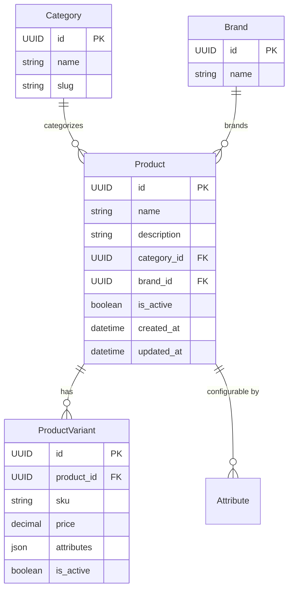
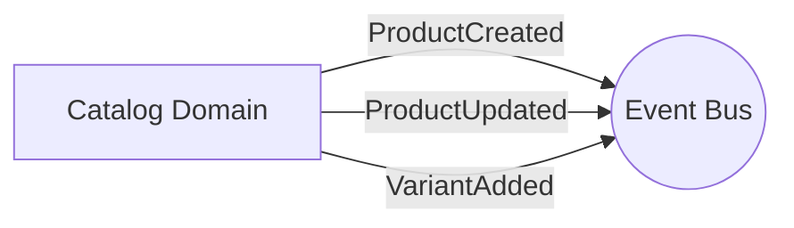

# Catalog Domain

## Overview
The Catalog domain manages all product information available in the store. This encompasses product definitions, categories, brands, configurable attributes, and individual product variants (SKUs) which map to physical items.

## Data Models

### Entities
| Entity | Description | Core Attributes |
|---|---|---|
| **Product** | The base product definition. | `id`, `name`, `category_id`, `brand_id` |
| **ProductVariant** | A specific sellable variant (SKU) of a Product. | `id`, `product_id`, `sku`, `price`, `attributes` |
| **Category** | Hierarchical grouping for products. | `id`, `name`, `slug` |
| **Brand** | The brand/manufacturer of the product. | `id`, `name` |
| **Attribute** | Dynamic product properties (e.g., Color, Size). | `id`, `name`, `type` |

## Events

### Emitted Events
- `ProductCreated(product_id)`
- `ProductUpdated(product_id)`
- `ProductDeleted(product_id)`
- `VariantAdded(variant_id, product_id)`
- `CategoryCreated(category_id)`
- `BrandCreated(brand_id)`

## Services & Business Logic

### Product Service
- Manages the core product catalog and ensures SKUs are unique.
- Soft-deletes products (marking `is_active = false`) instead of hard deletion.

### Category & Brand Services
- Manage metadata taxonomies used for filtering and organizing the product catalog.

## API Endpoints

| Method | Endpoint | Description | Service Method |
|---|---|---|---|
| `POST` | `/api/v1/products` | Create a new product | `ProductService.create_product` |
| `GET` | `/api/v1/products` | List products with filters | `ProductService.list_products` |
| `GET` | `/api/v1/products/<uuid>` | Get a specific product | `ProductService.get_product` |
| `POST` | `/api/v1/products/<uuid>/variants` | Add a variant to a product | `ProductService.add_variant` |
| `GET` | `/api/v1/categories` | List product categories | `CategoryService.list_categories` |
| `GET` | `/api/v1/brands` | List brands | `BrandService.list_brands` |
