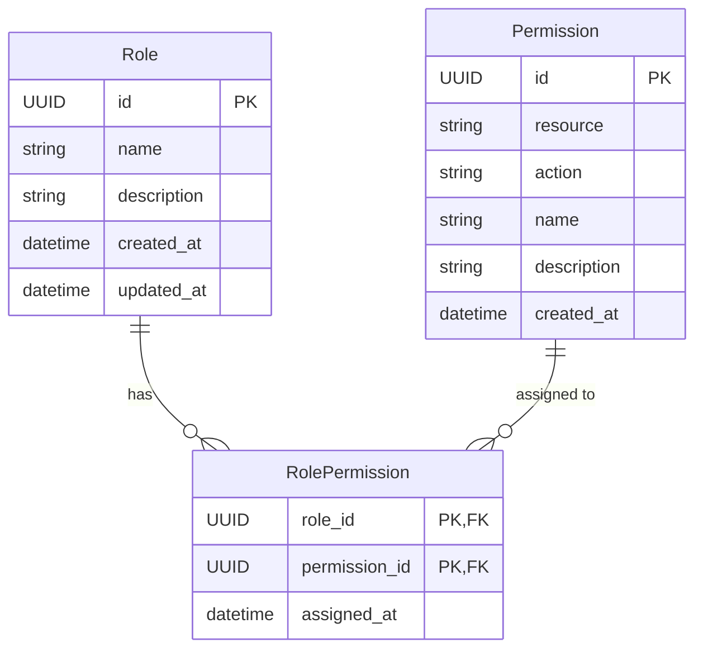
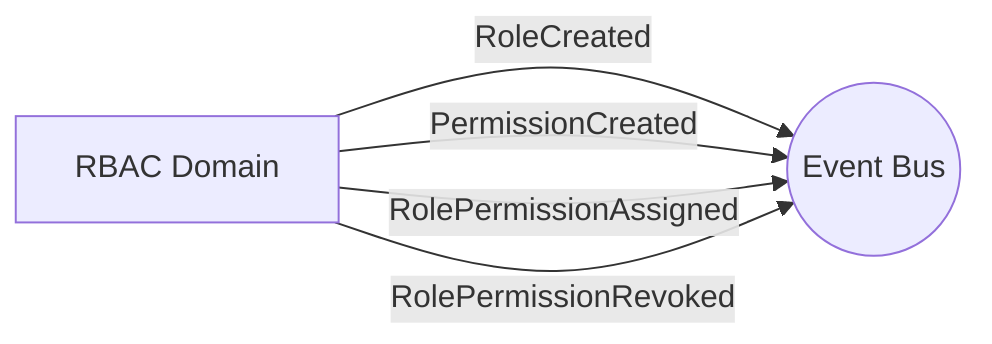

# RBAC Domain

## Overview
The Role-Based Access Control (RBAC) domain governs permissions and access rights across the platform. It manages Roles (e.g., `Admin`, `Customer`), Permissions (e.g., `create_product`, `view_orders`), and the association between them.

## Data Models

### Entities
| Entity | Description | Core Attributes |
|---|---|---|
| **Role** | A group of permissions representing a user persona. | `id`, `name`, `description` |
| **Permission** | A specific action allowed on a specific resource. | `id`, `resource`, `action` |
| **RolePermission** | Association between a Role and a Permission. | `role_id`, `permission_id` |

## Events

### Emitted Events
- `RoleCreated(role_id, name)`
- `RoleDeleted(role_id)`
- `PermissionCreated(permission_id, resource, action)`
- `RolePermissionAssigned(role_id, permission_id)`
- `RolePermissionRevoked(role_id, permission_id)`

## Services & Business Logic

### Role Service
- Handles creation, retrieval, and deletion of roles.
- Prevents deletion of roles that are currently assigned to active accounts.

### Permission Service
- Manages the granular resource-action pairings (e.g., `catalog:write`).

### RolePermission Service
- Connects roles to permissions, allowing roles to accumulate access rights.

## API Endpoints

| Method | Endpoint | Description | Service Method |
|---|---|---|---|
| `POST` | `/api/v1/roles` | Create a new role | `RoleService.create_role` |
| `GET` | `/api/v1/roles` | List all roles | `RoleService.list_roles` |
| `GET` | `/api/v1/roles/<uuid>` | Get a specific role | `RoleService.get_role` |
| `DELETE`| `/api/v1/roles/<uuid>` | Delete a role | `RoleService.delete_role` |
| `POST` | `/api/v1/permissions` | Create a permission | `PermissionService.create_permission` |
| `GET` | `/api/v1/permissions` | List all permissions | `PermissionService.list_permissions` |
| `DELETE`| `/api/v1/permissions/<uuid>` | Delete a permission | `PermissionService.delete_permission` |
| `POST` | `/api/v1/roles/<uuid>/permissions` | Assign permission to role | `RolePermissionService.assign` |
| `DELETE`| `/api/v1/roles/<uuid>/permissions/<uuid>` | Revoke permission from role | `RolePermissionService.revoke` |
