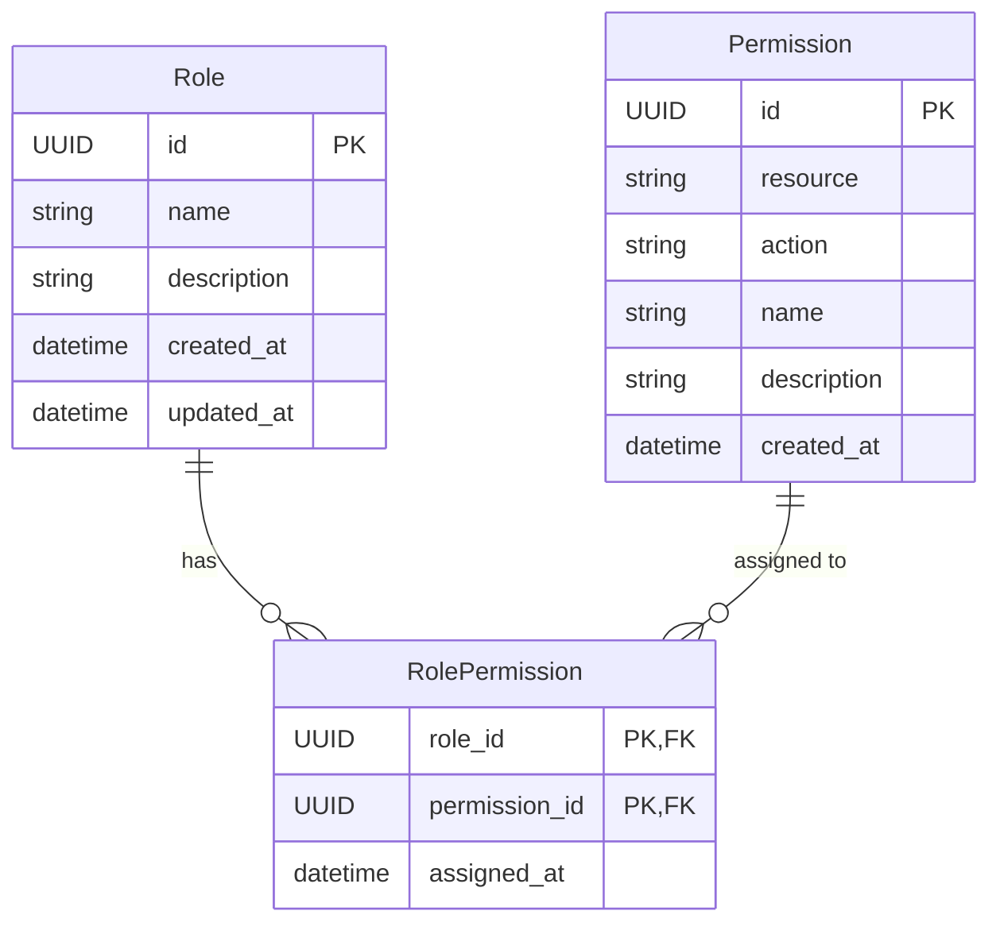
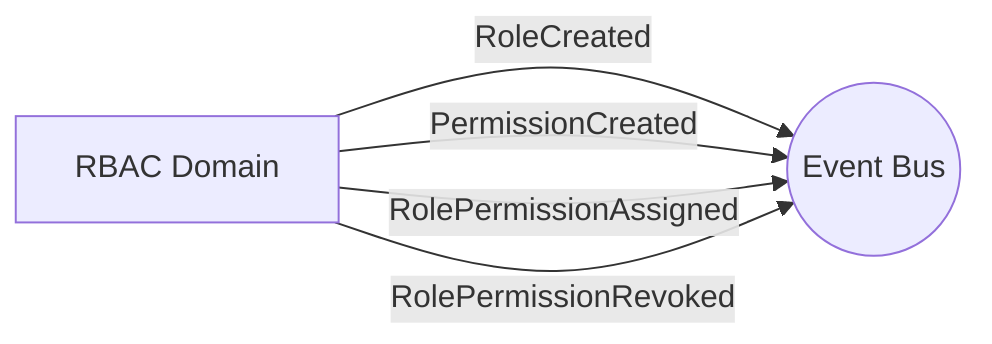
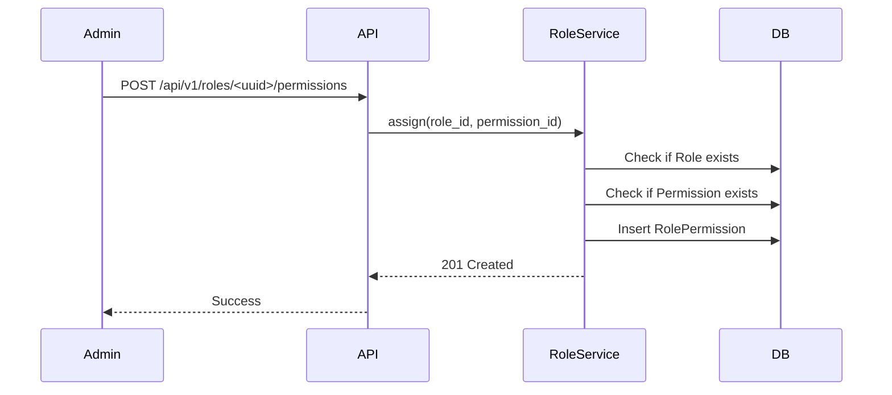

# RBAC Domain

## Overview
The Role-Based Access Control (RBAC) domain governs permissions and access rights across the platform. It manages Roles (e.g., `Admin`, `Customer`), Permissions (e.g., `create_product`, `view_orders`), and the association between them.

## Data Models

### Entities

| Entity | Description | Core Attributes |
|---|---|---|
| **Role** | A group of permissions representing a user persona. | `id`, `name`, `description` |
| **Permission** | A specific action allowed on a specific resource. | `id`, `resource`, `action` |
| **RolePermission** | Association between a Role and a Permission. | `role_id`, `permission_id` |

## Events

The RBAC domain emits the following events when mutations occur:

### Emitted Events
- `RoleCreated(role_id, name)`
- `RoleDeleted(role_id)`
- `PermissionCreated(permission_id, resource, action)`
- `RolePermissionAssigned(role_id, permission_id)`
- `RolePermissionRevoked(role_id, permission_id)`

### Subscribed Events
*The RBAC domain does not currently subscribe to events from other domains.*

## Services & Business Logic

The domain logic is split across three entity-specific services:

### Assignment Sequence
This flow demonstrates how a Role is assigned a new Permission.

### Role Service
- Handles creation, retrieval, and deletion of roles.
- Prevents deletion of roles that are currently assigned to active accounts.

### Permission Service
- Manages the granular resource-action pairings (e.g., `catalog:write`).

### RolePermission Service
- Connects roles to permissions, allowing roles to accumulate access rights.

## API Endpoints

### Roles

#### `POST /api/v1/roles`
- **Use Case:** Creating a new role for the system (e.g., "Store Manager").
- **Request Schema (`CreateRoleRequest`):**
  - `name` (string, length 1-100, required)
  - `description` (string, max length 255, optional)
- **Responses:**
  - **`201 Created`**: Returns `RoleResponse`.
  - **`400 Bad Request`**: Validation error if fields are invalid.
  - **`409 Conflict`**: Role with the same name already exists.

#### `GET /api/v1/roles`
- **Use Case:** Listing all available roles.
- **Responses:**
  - **`200 OK`**: Returns a list of `RoleResponse`.

#### `GET /api/v1/roles/<uuid>`
- **Use Case:** Fetching details of a specific role.
- **Responses:**
  - **`200 OK`**: Returns `RoleResponse`.
  - **`404 Not Found`**: Role not found.

#### `PUT /api/v1/roles/<uuid>`
- **Use Case:** Updating existing role details (currently only description updates are supported).
- **Request Schema (`UpdateRoleRequest`):**
  - `description` (string, max length 255, optional)
- **Responses:**
  - **`200 OK`**: Returns updated `RoleResponse`.
  - **`400/422`**: Validation errors.
  - **`404 Not Found`**: Role not found.

#### `DELETE /api/v1/roles/<uuid>`
- **Use Case:** Deleting a role. Prevents deletion if the role is currently assigned to any active account.
- **Responses:**
  - **`200 OK`**: Role successfully deleted.
  - **`404 Not Found`**: Role not found.
  - **`409 Conflict`**: Role is currently assigned to accounts and cannot be deleted.

### Permissions

#### `POST /api/v1/permissions`
- **Use Case:** Creating a new granular permission (e.g., resource=`catalog`, action=`write`).
- **Request Schema (`CreatePermissionRequest`):**
  - `resource` (string, length 1-100, required)
  - `action` (string, length 1-100, required)
  - `description` (string, max length 255, optional)
- **Responses:**
  - **`201 Created`**: Returns `PermissionResponse`.
  - **`400 Bad Request`**: Validation error.
  - **`409 Conflict`**: Permission for resource+action already exists.

#### `GET /api/v1/permissions`
- **Use Case:** Listing all available permissions in the system.
- **Responses:**
  - **`200 OK`**: Returns a list of `PermissionResponse`.

#### `DELETE /api/v1/permissions/<uuid>`
- **Use Case:** Deleting a permission entirely from the system.
- **Responses:**
  - **`200 OK`**: Permission successfully deleted.
  - **`404 Not Found`**: Permission not found.

### Role Permissions

#### `POST /api/v1/roles/<uuid>/permissions`
- **Use Case:** Assigning a specific permission to a role.
- **Request Schema (`AssignPermissionRequest`):**
  - `permission_id` (UUID, required)
- **Responses:**
  - **`201 Created`**: Returns a success confirmation.
  - **`404 Not Found`**: If role or permission does not exist.
  - **`409 Conflict`**: If the permission is already assigned to the role.

#### `GET /api/v1/roles/<uuid>/permissions`
- **Use Case:** Listing all permissions assigned to this role.
- **Responses:**
  - **`200 OK`**: Returns a list of `PermissionResponse`.

#### `DELETE /api/v1/roles/<uuid>/permissions/<permission_uuid>`
- **Use Case:** Revoking a permission from a role.
- **Responses:**
  - **`200 OK`**: Returns a success confirmation.

### Common Response Schemas

#### `RoleResponse`
- `id` (UUID)
- `name` (string)
- `description` (string | null)
- `created_at` (datetime)
- `updated_at` (datetime)

#### `PermissionResponse`
- `id` (UUID)
- `resource` (string)
- `action` (string)
- `name` (string, auto-generated from resource and action)
- `description` (string | null)
- `created_at` (datetime)
