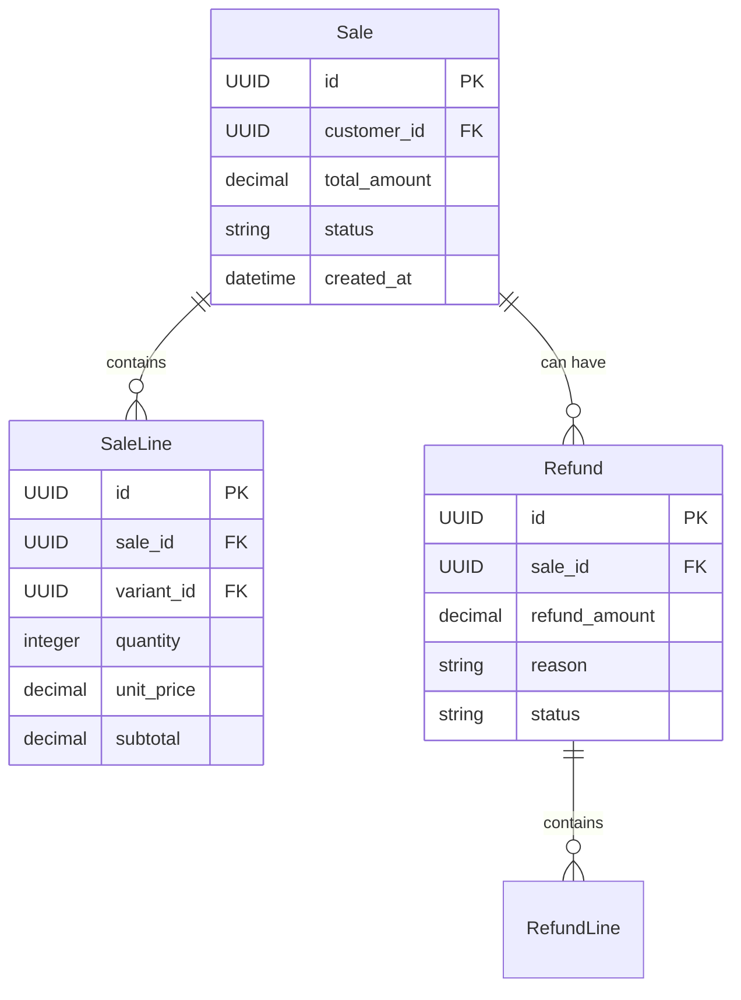
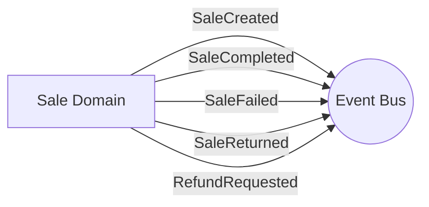

# Sale Domain

## Overview
The Sale domain orchestrates customer transactions, checkout processing, and refunds. It ties together the products being purchased (Catalog), the inventory required (Stock), and the customer making the purchase (Accounts).

## Data Models

### Entities

| Entity | Description | Core Attributes |
|---|---|---|
| **Sale** | Represents a customer's order. | `id`, `customer_id`, `total_amount`, `status` |
| **SaleLine** | Individual items purchased in a Sale. | `id`, `sale_id`, `variant_id`, `quantity`, `price` |
| **Refund** | A refund issued against a completed Sale. | `id`, `sale_id`, `refund_amount`, `status` |

## Events

### Emitted Events
- `SaleCreated(sale_id)`: Fired when an order is initiated (pending payment).
- `SaleCompleted(sale_id)`: Fired when payment succeeds and order is finalized.
- `SaleFailed(sale_id)`: Fired when payment or inventory allocation fails.
- `SaleReturned(sale_id)`: Fired when a sale is fully returned.
- `RefundRequested(refund_id, sale_id)`: Fired when a refund is initiated.

## Services & Business Logic

### Sale Service
- Validates that requested variants exist and have sufficient stock before finalizing a Sale.
- Computes `total_amount` based on variant prices and quantities.
- Emits events that downstream domains (like Stock) listen to for decrementing inventory.

### Refund Service
- Ensures that refund quantities do not exceed the originally purchased quantities (`RefundQuantityExceededError`).
- Validates the `Sale` state (must be completed) before authorizing a refund.

## API Endpoints

| Method | Endpoint | Description | Service Method |
|---|---|---|---|
| `POST` | `/api/v1/sales/checkout` | Initiate a new checkout | `SaleService.checkout` |
| `GET` | `/api/v1/sales/<uuid>` | Get details of a sale | `SaleService.get_sale` |
| `POST` | `/api/v1/sales/<uuid>/refunds` | Request a refund for a sale | `RefundService.create_refund` |
