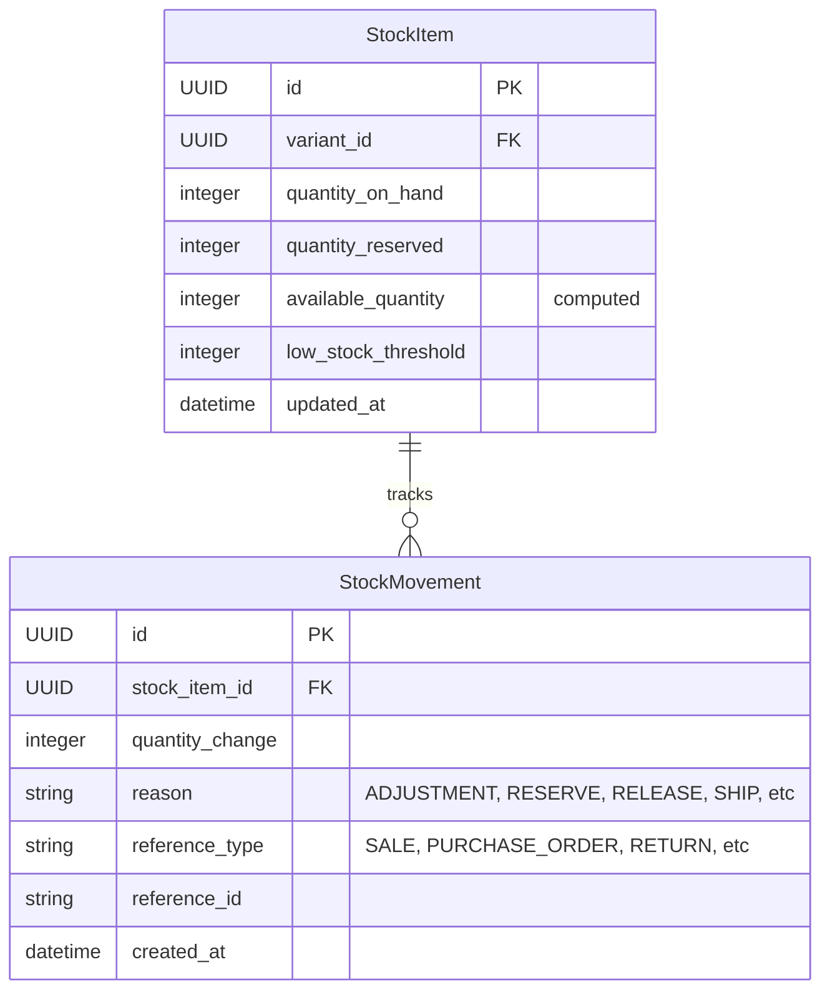
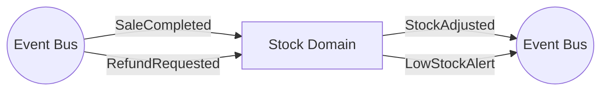

# Stock Domain

## Overview
The Stock domain is responsible for managing physical inventory levels of product variants (SKUs). It tracks the current available stock and records historical stock movements (inbound and outbound) to ensure a complete audit trail.

## Data Models

### Entities

| Entity | Description | Core Attributes |
|---|---|---|
| **StockItem** | The current inventory snapshot for a specific product variant. | `id`, `variant_id`, `quantity_on_hand`, `quantity_reserved`, `available_quantity` |
| **StockMovement** | An immutable ledger entry of an inventory change. | `id`, `stock_item_id`, `quantity_change`, `reason`, `reference_type` |

## Events

### Emitted Events
- `StockAdjusted(stock_item_id, new_quantity)`
- `LowStockAlert(stock_item_id, variant_id)`: Emitted when `available_quantity` falls below `low_stock_threshold`.

### Subscribed Events
- `SaleCompleted`: Reduces `available_quantity` for the purchased variants.
- `RefundRequested`: Increases `available_quantity` when items are returned to stock.

## Services & Business Logic

### StockItem Service
- Manages thresholds and acts as the current view of inventory.
- Throws `StockItemNotFound` if attempting to adjust stock for an untracked variant.

### StockMovement Service
- Operates as an append-only ledger. Every change to a `StockItem`'s quantity must be accompanied by a `StockMovement` detailing why it changed.
- Validates that outbound movements do not drop `available_quantity` below zero.

## API Endpoints

| Method | Endpoint | Description | Service Method |
|---|---|---|---|
| `GET` | `/api/v1/stock/items` | List stock items | `StockItemService.list_stock_items` |
| `GET` | `/api/v1/stock/items/<uuid>` | Get stock item by variant | `StockItemService.get_stock_item` |
| `POST` | `/api/v1/stock/items/<uuid>/adjust` | Manually adjust stock | `StockMovementService.adjust_stock` |
| `POST` | `/api/v1/stock/items/<uuid>/reserve` | Reserve stock temporarily | `StockMovementService.reserve_stock` |
| `POST` | `/api/v1/stock/items/<uuid>/release` | Release reserved stock | `StockMovementService.release_stock` |
| `POST` | `/api/v1/stock/items/<uuid>/ship` | Ship reserved stock | `StockMovementService.ship_stock` |
| `PUT` | `/api/v1/stock/items/<uuid>/threshold` | Set low stock threshold | `StockItemService.set_threshold` |
| `GET` | `/api/v1/stock/movements` | View stock movement ledger | `StockMovementService.list_movements` |
